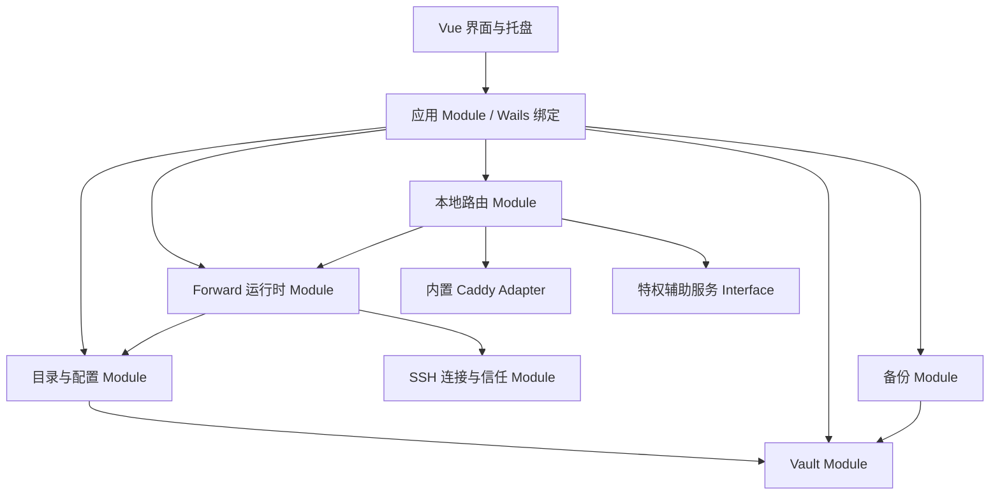

# TunnelBoard MVP 模块划分与迭代计划

## 目标与约束

TunnelBoard 是个人电脑本地运行的 SSH Tunnel 管理工具。它管理 SSH 主机、任意 TCP Forward、可选 hosts 映射和可选 Caddy HTTPS 入口。

- 不引入 Profile；文件夹最多两层，仅用于整理 Forward。
- Forward 可独立运行，多个引用同一 SSH 主机的 Forward 暂不复用 SSH 连接。
- 主程序保持普通权限；系统修改通过受限特权辅助服务完成。
- 日常数据使用本地 Vault；可迁移备份始终由用户密码独立加密。
- 默认无遥测、授权或 AI Debug 网络请求；仅保留可关闭的更新检查。
- 不兼容导入旧版 Loris 配置。

本文假设首个完整交付以 Windows 为验收环境。所有涉及特权操作的 Module 先定义跨平台 Interface，macOS 与 Linux 通过各自 Adapter 补齐，不把 Windows 实现扩散到业务层。

## 模块关系

界面只能调用应用 Module；它不直接读写 Vault、hosts、证书或 Caddy 文件。这样系统权限、证书细节与运行时状态集中在少数深 Module 内，调用方只需理解小的 Interface。

## 模块与 Interface

| Module | 对外 Interface | 内部职责与不变量 | 现有代码处置 |
| --- | --- | --- | --- |
| 应用 Module | `GetSnapshot`、`Execute(command)`、`SubscribeRuntimeEvents` | Wails 的唯一绑定入口；把业务结果转换为 UI 可用的快照与错误，不承载业务规则。 | 收敛 `app.go` 的大量逐项绑定。 |
| Vault Module | `Load`、`Update`、`Export(password)`、`StageImport(file,password)`、`CommitImport(plan)` | 初始化生成本地随机密钥；日常数据加密落盘；备份与本机 Vault 使用不同密钥边界；导入不产生系统副作用。 | 替换 `internal/conf` 的明文 TOML、license 字段与原地覆盖导入。 |
| 目录与配置 Module | `CreateFolder`、`MoveForward`、`SaveSSHHost`、`SaveForward`、`DeleteSelection` | 维护两层文件夹、SSH 主机、Forward、Web Route 之间的引用完整性；阻止删除仍被引用的 SSH 主机；非空文件夹只允许移动内容或二次确认级联删除。 | 由 `internal/model`、`internal/biz/jumper.go`、`internal/biz/tunnel.go` 演进。 |
| SSH 连接与信任 Module | `Connect(chain)`、`VerifyOrEnrollHostKey` | 支持密码、私钥文件/口令与 SSH Agent；首次显示并确认主机指纹，后续变化阻断；安全错误不自动重试。 | 复用并改造 `internal/forward` 的拨号、Agent 与 SSH 链实现。 |
| Forward 运行时 Module | `Start(id)`、`Stop(id)`、`StartMany(ids)`、`Status(id)` | 实现 `-L`、`-R`、`-D`；真实监听结果兜底端口冲突；运行中断线指数退避重连；每条 Forward 独立连接。 | 重点复用 `internal/forward/port_forward.go` 和现有运行状态管理。 |
| 本地路由 Module | `PreviewRoute`、`ApplyRoute`、`RemoveRoute`、`RouteStatus` | 管理 hosts 与 Caddy 开关的独立状态；只允许本地 `-L` 关联 Route；编译 `tls internal` 配置；HTTPS 上游要求 TLS SNI 并严格校验；443 冲突不启动 Caddy。 | 新建；不能把逻辑散落在 Vue 或 Forward 运行时。 |
| 特权辅助服务 Interface | `EnsureInstalled`、`ApplyManagedHosts`、`RemoveManagedHosts`、`TrustLocalCA`、`UntrustLocalCA` | 仅能修改标记化 hosts 区块和 TunnelBoard 本地 CA 信任；不接受任意命令、路径或证书；主程序无管理员常驻权限。 | 新建独立进程/服务及 OS Adapter。 |
| 内置 Caddy Adapter | `Start`、`Reload`、`Stop`、`DiagnosePort` | 使用随安装包固定版本交付的 Caddy；所有本地域名仅用本地 CA，不发起 ACME；最后一个启用 Route 移除后停止 Caddy。 | 新建并加入打包流水线。 |
| 备份 Module | `CreateBackup`、`PreviewImport`、`ApplyImport` | 用户密码加密完整备份；私钥文件默认不含，需显式选择；追加导入为默认，完全还原必须二次确认。 | 从现有“选择文件后覆盖 config.toml”的流程替换而来。 |
| 更新 Module | `Check`、`SetEnabled` | 仅用户可见的 GitHub 更新检查；关闭后绝不后台联网。 | 保留 `internal/updater`，移除与授权、遥测耦合。 |

## 迭代顺序

### 迭代 0：产品基线与隐私清理

目标是让 Fork 成为独立产品，而不是带有上游商业与遥测残留的改名应用。

- 更名 Go module、Wails 名称、配置目录、日志文件、单实例 ID、图标与文案。
- 移除 `internal/license`、`internal/aidebug`、机器标识和前端 analytics；删除对应绑定、页面与构建开关。
- 保留更新 Module，并增加“自动检查更新”设置项，默认开启。
- 保留现有托盘生命周期，改为“运行中关闭窗口最小化，显式退出才停止”。

验收：抓包或代码审查可证明，除更新检查与用户建立的 SSH 连接外不存在应用主动网络请求。

### 迭代 1：Vault 与新领域模型

先建立安全、可测试的数据底座，再迁移任何功能页面。

- 实现 Vault Module 与新的加密数据格式；首次启动创建本地随机密钥。
- 建立文件夹（最多两层）、SSH 主机、Forward、Web Route 的模型与引用校验。
- 落地 SSH 主机指纹的首次确认与变更阻断模型。
- 实现最小管理界面：文件夹树、SSH 主机编辑、Forward 新建/编辑/批量删除。
- 不读取、不迁移旧 Loris 配置；导入入口暂不出现。

验收：磁盘上不再有可直接读取的密码与私钥口令；删除和引用规则可通过纯业务测试验证。

### 迭代 2：可用的 SSH Forward 垂直切片

交付不依赖 Caddy 的完整日常价值。

- 接入 `-L`、`-R`、`-D` 运行时，复用现有 SSH 转发实现。
- 完成端口预检、真实绑定失败提示、运行状态、批量启停与自动启动开关。
- 完成断线重连策略：最长 1 分钟指数退避；认证失败、指纹变化和手动停止不重连。
- 将托盘与自动启动接到 Forward 运行时，而非旧 Tunnel 状态。

验收：用户可创建 SSH 主机和多条 Forward，在不启用 hosts/Caddy 的前提下稳定访问 TCP 服务。

### 迭代 3：hosts、特权辅助服务与 Caddy Route

这是产品与上游拉开差异的重点迭代。

- 先实现受限特权辅助服务的安装、身份校验和操作白名单；主程序绝不提升为管理员。
- 实现受托管 hosts 区块、回滚与非本地域名覆盖确认；单独 hosts 开关支持“域名 + 端口”。
- 将固定版本 Caddy 加入安装包；实现全局单进程、配置编译、热重载、443 冲突诊断。
- 实现 HTTP 上游与 HTTPS 上游 Route：后者要求 TLS SNI，默认透传原始请求 `Host`，并支持继承 TLS SNI 或自定义 `Host`，严格校验证书。
- 最后一个启用的 Caddy Route 关闭/删除时，停止 Caddy 并撤销本地 CA 信任。

验收：同一台机器可通过多个自定义域名稳定访问不同 Forward；hosts/Caddy 失败都可解释并可精确回滚。

### 迭代 4：备份、恢复与运维完成度

- 完成密码加密备份、私钥文件显式包含选项、导入预览和冲突处理。
- 默认追加到新顶层文件夹；导入不会自动启动 Forward、写 hosts 或启动/重载 Caddy。
- 完全还原作为独立、二次确认的操作。
- 日志脱敏、Route/Forward 诊断页、更新设置与可导出的故障报告。

验收：可在一台已有数据的电脑上安全导入备份且不改变网络行为；用户显式应用后才恢复所选能力。

### 迭代 5：跨平台与发布硬化

- 为 macOS 和 Linux 实现特权辅助服务 Adapter，并逐项验证 hosts、根证书、托盘和自动启动行为。
- 为每个平台打包并验证内置 Caddy；校验版本、完整性、签名与升级兼容性。
- 端到端回归：SSH 指纹变化、443 冲突、hosts 回滚、断线重连、导入中断与显式退出。
- 将现有 SSH config 导入等便利功能作为后续增强逐项评估，不阻塞 MVP。

## 不应发生的耦合

- Vue 页面不得直接写 hosts、启动 Caddy 或读取密钥文件。
- Forward 运行时不得知道 hosts、Caddy 或本地 CA 的存在。
- 特权辅助服务不得接收来自 UI 的任意 shell 命令。
- Vault 导入不得直接启动运行时或产生系统修改。
- 更新检查不得依赖机器 ID、授权状态或遥测事件。

## 第一批可拆分任务

1. 更名与删除上游联网/商业模块。
2. 定义 Vault 文件格式、密钥生命周期和备份包格式。
3. 实现新模型与 Vault 仓储测试。
4. 将现有 SSH Forward 运行时接入新模型与指纹策略。
5. 建立文件夹树、SSH 主机和 Forward 的基础界面。
6. 设计并实现受限特权辅助服务的 Windows Adapter。
7. 接入内置 Caddy 与 Web Route 界面。

前五项能够先产出一个安全、轻量、无 Caddy 也可日常使用的 TunnelBoard；第六和第七项再形成“本地域名 + HTTPS”的核心差异。
